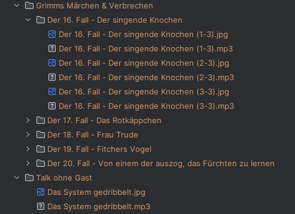

This script can download mp3s and covers from ARD audiothek.
This project is a [Fork](https://github.com/Leetcore/audiothek-downloader).

# Installation

```bash
git clone "https://github.com/Schluggi/audiothek-downloader.git"
cd audiothek-downloader
python3 -m venv venv
source venv/bin/activate
pip3 install -r requirements.in
```

# Usage

``` bash
python3 audiothek.py \
--url 'https://www.ardaudiothek.de/sendung/grimms-maerchen-und-verbrechen/urn:ard:show:b739e5e19ba7f23c/' \
--directory ./output \
--group-episodes \ 
--square-images
```

## Screenshots



## Supported URL-Types

Here is the information refactored into a Markdown table:

| URL-Type                | Description                                 | Example URL                                                                                         |
|-------------------------|---------------------------------------------|-----------------------------------------------------------------------------------------------------|
| `show` (Sendung)        | A single show, e.g. a podcast or radio show | `https://www.ardaudiothek.de/sendung/grimms-maerchen-und-verbrechen/urn:ard:show:b739e5e19ba7f23c/` |
| `publication` (Episode) | A single episode of a show                  | `https://www.ardaudiothek.de/episode/urn:ard:publication:87d9866e81da85d0/`                         |

## Arguments

| Argument           | Short | Type   | Default  | Required | Description                                                         |
|--------------------|-------|--------|----------|----------|---------------------------------------------------------------------|
| `--url`            | `-u`  | `str`  | -        | Yes      | Insert Audiothek URL (e.g. https://www.ardaudiothek.de/sendung/...) |
| `--directory`      | `-f`  | `str`  | `output` | No       | Directory to save all MP3s                                          |
| `--square-images`  | `-s`  | `bool` | `False`  | No       | Download images in 1:1 aspect ratio instead of widescreen           |
| `--group-episodes` | `-g`  | `bool` | `False`  | No       | Group episodes into their own subdirectories                        |
| `--template`       | `-t`  | `str`  | show id  | No       | The name of the rename template (try `-t episodeNumbers`)           |
